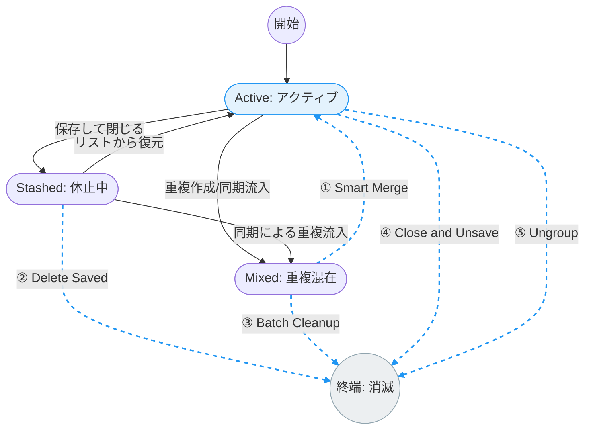

# Chrome拡張機能：TidyGroup-Solo 機能仕様書

## 第1章：製品コンセプト

大量に蓄積し、重複した「タブグループ」および「保存済みタブグループ」を、APIベースのロジックで整理・クレンジングするツール。

有効かつ必要なタブグループだけを残し、ブックマークツールバーやメニューの視認性を向上させる。

## 第2章：開発ガイドライン（Soloポリシー）

- **Zero Dependencies**: 外部ライブラリ（jQuery, React等）を使用せず、Vanilla JavaScriptのみで構築する。
- **Private & Local**: 外部サーバーとの通信は一切行わず、すべての処理をブラウザ内で完結させる。
- **Modern Aesthetics**: Google Material Design 3 (M3) のガイドラインに準拠した、クリーンで直感的なUI。

## 第3章：ターゲット環境

- **対応ブラウザ**: Google Chrome バージョン 122 以上（`SavedTabGroup` APIをフル活用するため）。
- **前提条件**: アカウント同期（Sync）のON/OFFに関わらず、同等のロジックで価値を提供。

## 第4章：タブグループの状態定義

個々のタブグループは、以下の4つの状態を定義し、管理対象とする。

1. **[Active] アクティブ**: ウィンドウ内にタブグループとして存在している。
2. **[Stashed] 休止中**: 保存済みだが、ウィンドウ内で表示されておらずリストにのみ存在している。
3. **[Mixed] 重複混在**: 同名のタブグループが複数存在している。
4. **[End] 消滅**: 管理リストから完全に抹消された。

## 第5章：状態遷移図 (State Transition Diagram)

※実線はユーザーの日常操作、**青い点線はTidyGroup-Soloによるアシスト**。

## 第6章：主要機能（アクション）

図上の①〜⑤の遷移に対応する5つのコア機能。

1. **① Smart Merge (スマート・マージ)**:
重複混在状態を解消。重複する複数の保存済みタブグループを一つに集約し、現在の「アクティブ」なウィンドウの単一のタブグループへタブを集め統合する。
2. **② Delete Saved (保存の直接削除)**:
「Stashed」状態を解消。一度もタブとして展開することなく、不要な保存済みリストを直接消去する。
3. **③ Batch Cleanup (一括クレンジング)**:
重複混在状態および休止状態にある不要なタブグループを一括で削除する。タブグループに一つもタブが存在しない、あるいは一定期間(例: 1ヶ月以上)更新されていない「休止中」のタブグループをまとめて消去する。
4. **④ Close and Unsave (完結処理)**:
アクティブ状態を終了。現在開いているタブを閉じると同時に、保存済みリストからも削除し、タブグループを完全に破棄する。
5. **⑤ Ungroup (タブグループ解体)**:
タブグループを解除。タブグループという管理単位を捨て、中身のタブをバラバラな状態で残す。

## 第7章：要否判定のための表示情報

ユーザーが安心して「捨てる」判断を下すために可視化する項目。

- **タブ数**: タブグループ内の正確なタブ数。
- **ドメイン・サマリー**: タブグループに含まれるタブの主要なホスト名のリスト（例：github.com, slack.com）。
- **モバイル・フラグ**: モバイル用URLの有無を確認し、他端末データの誤削除を防止。
- **更新日時**: 最後にタブグループが変更された日時。

## 第8章：UI/UX 仕様

- **Layout**: Navigation Rail（左）と、各タブグループをM3カード形式で並べたメインエリア（右）。
- **Visual Feedback**: アクティブなものは浮き上がったカード、休止中のタブグループは枠線のみのカードで表現。
- **FAB (Floating Action Button)**: 画面右下に「一括クリーンアップ」ボタンを配置。

## 第9章：利用API

- `chrome.tabGroups.query({})`: 現在開いているタブグループの取得。
- `chrome.tabGroups.getAllSavedGroups()`: 保存済みタブグループ(アクティブ,休止中を含む)の全取得。
- `chrome.tabGroups.deleteSavedGroup(id)`: 保存リストからのタブグループの直接削除。
- `chrome.tabs.group()` / `ungroup()`: タブの移動およびタブグループの解体。

## 第10章：状態判別ロジック

1. **Active**: `SavedTabGroup.localGroupId !== null`
2. **Stashed**: `SavedTabGroup.localGroupId === null`
3. **Mixed**: `SavedTabGroup` の配列を `title` で集計し、件数が2件以上のもの。
4. **Empty (即時消去対象)**: 中身のタブが0、または「新しいタブ」1つのみの状態。

## 第11章：今後の拡張性

- **Archive to Folder**: 削除する代わりに、特定のブックマークフォルダへURLリストとして退避。
- **Auto-Maintenance**: ブラウザ終了時や起動時に、条件に合致する「ゴミ」を自動クリーンアップ。
