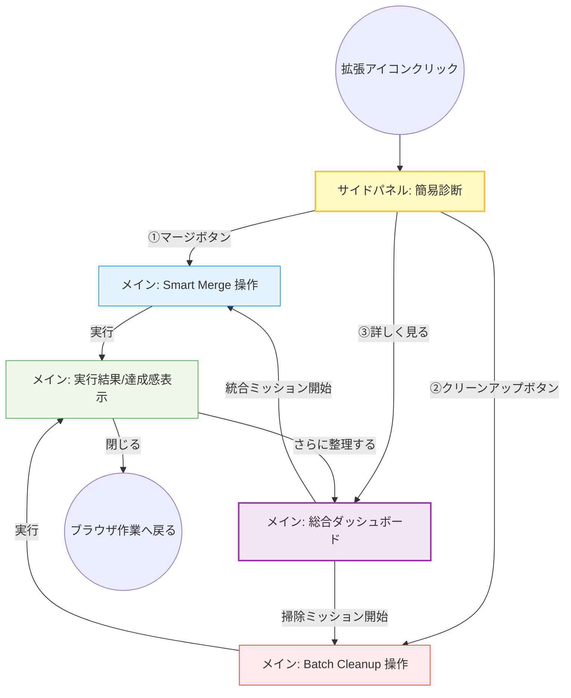

# TidyGroup-Solo UI仕様書

## 1. ページ構成・遷移図

サイドパネルを「きっかけ」とし、メインパネルの「総合ダッシュボード」をハブとして各ミッションへ向かう構造です。

## 2. ページ内構成の詳細（表示項目と操作項目）

各画面における「情報の提示（M3の静的要素）」と「ユーザーのアクション（M3の動的要素）」を整理しました。

### 2.1. サイドパネル (sidepanel.html)

**役割：** ブラウザ作業の邪魔をせず、現在の「汚れ」を数値で警告するスコアボード。

| **表示項目 (Information)** | **操作項目 (Action)** |
| --- | --- |
| **健康スコア**: 100点満点中の現在値 | **[詳細をチェック]**: メインの総合ダッシュボードを開く |
| **異常検知バッジ**: 「重複あり」「放置あり」等の簡易通知 | **[マージを開始]**: MergePageへ直接遷移 |
| **ミニマム統計**: タブグループ総数、消費しているタブ数 | **[一括掃除]**: CleanupPageへ直接遷移 |

### 2.2. メイン：総合ダッシュボード (Dashboard)

**役割：** CleanMyMacのように、すべての問題点を俯瞰し、どの「ミッション」から着手するかを決めるハブ。

| **表示項目 (Information)** | **操作項目 (Action)** |
| --- | --- |
| **分析ステータスカード**: 「重複」「放置」「空」の各状況の詳細 | **[ミッション開始ボタン]**: 各専用操作ページへの遷移 |
| **リソース統計**: タブグループが占める割合やメモリの視覚化グラフ | **[再スキャン]**: 現在の最新状態を再取得して分析 |
| **最近の履歴**: 前回いつ、どれだけのクリーンアップを行ったか | **[設定]**: 自動メンテナンスや除外ドメインの設定（将来用） |

### 2.3. メイン：Smart Merge 操作ページ

**役割：** 重複した残骸を一つにまとめ、情報を「名寄せ」する。

| **表示項目 (Information)** | **操作項目 (Action)** |
| --- | --- |
| **マージ元候補エリア**: 同名・類似URLの保存済みタブグループ群 | **チェックボックス**: 統合したい「古い残骸」を選択 |
| **マージ先指定エリア**: 現在開いている（アクティブ）タブグループ群 | **ラジオボタン**: どのタブグループに情報を集約するか1つ選択 |
| **マージ後予測**: 合計されるタブ数、重複排除されるURL数 | **[マージを実行]**: 指定したアクティブなタブグループへ統合し、他を消去 |
| **機能説明**: 「実行すると古い保存データは削除されます」の警告 | **[キャンセル]**: 総合ダッシュボードへ戻る |

### 2.4. メイン：Batch Cleanup 操作ページ

**役割：** 条件に基づいて「無価値なデータ」を効率よく一掃する。

| **表示項目 (Information)** | **操作項目 (Action)** |
| --- | --- |
| **クリーンアップ・フィルタ**: 期間指定（1ヶ月以上〜）、中身の数 | **スライダー/チップ**: 削除対象とする閾値を設定 |
| **削除対象プレビュー**: 条件に合致したタブグループをグリッド表示 | **個別除外ボタン**: 自動判定されたが「残したい」ものを外す |
| **保護対象の明示**: 他デバイス（モバイル）データの保護状態 | **[XX件を今すぐ削除]**: 確定したリストを一括抹走 |

### 2.5. メイン：実行結果ページ (End Mission)

**役割：** 掃除の結果を視覚化し、ユーザーに達成感と安心感を与える。

| **表示項目 (Information)** | **操作項目 (Action)** |
| --- | --- |
| **整理実績**: 「XX個の重複を解消」「XX個の空タブグループを削除」 | **[ダッシュボードへ戻る]**: 他の整理機能へ |
| **ビジュアルフィードバック**: スッキリしたブラウザのイメージや祝祭感 | **[タブを閉じる]**: 整理作業を終了して元の作業へ |
| **Tips**: 「次に溜まらないためのコツ」などの短いアドバイス | |
